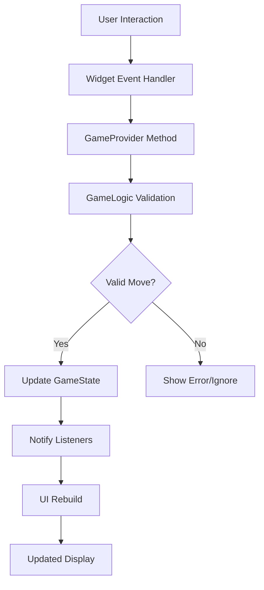

# Klondike Solitaire Flutter Web App Architecture Design

## Overview
This document outlines the high-level architecture for a Flutter web application implementing the classic Klondike solitaire card game. The design follows standard Klondike rules: 52-card deck, 7 tableau columns, 4 foundation piles, stock and waste piles, with alternating color descending sequences in tableau and same-suit ascending sequences in foundations.

## 1. Overall App Structure

### Screens
- **GameScreen**: Main game interface displaying the tableau, foundations, stock, and waste piles. Includes game controls (new game, undo if implemented).
- **MenuScreen**: Optional start screen with game options (difficulty levels, themes) and navigation to GameScreen.

### Widget Hierarchy
```
MaterialApp
├── MenuScreen (optional)
└── GameScreen
    ├── AppBar (game title, menu button)
    ├── GameBoard
    │   ├── FoundationsRow
    │   │   ├── FoundationPile (x4)
    │   ├── TableauArea
    │   │   ├── TableauColumn (x7)
    │   └── StockWasteArea
    │       ├── StockPile
    │       └── WastePile
    └── GameControls (new game, score display)
```

## 2. State Management Strategy

**Chosen Approach: Provider**

- **GameProvider**: Central state manager extending ChangeNotifier
  - Manages GameState instance
  - Provides methods for game actions (drawCard, moveCard, newGame)
  - Notifies listeners on state changes
- **CardProvider**: Optional per-card state for animations/transitions

**Rationale**:
- Provider is lightweight and sufficient for this game scope
- Built-in Flutter integration with Consumer widgets
- Easy to test and debug
- Avoids complexity of Riverpod for a single-screen game

**State Updates**:
- Drag-and-drop operations trigger Provider methods
- Automatic UI rebuilds on state changes
- Undo functionality can be implemented via state snapshots

## 3. Key Classes and Models

### Core Models
- **Card**: Represents a playing card
  - Properties: Suit (hearts, diamonds, clubs, spades), Rank (ace-king), faceUp (bool)
  - Methods: isRed(), isBlack(), canStackOn(otherCard)

- **Deck**: Manages card collection
  - Properties: List<Card>
  - Methods: shuffle(), drawCard(), reset()

### Game State Models
- **GameState**: Complete game state container
  - Properties: tableau (List<TableauColumn>), foundations (List<FoundationPile>), stock (Deck), waste (List<Card>)
  - Methods: isValidMove(), executeMove(), checkWinCondition()

- **TableauColumn**: Represents one of 7 tableau piles
  - Properties: List<Card> (face-down cards at bottom, face-up at top)
  - Methods: canAcceptCard(), addCard(), removeCard()

- **FoundationPile**: Represents one of 4 suit-specific piles
  - Properties: Suit suit, List<Card> cards
  - Methods: canAcceptCard(), addCard()

## 4. UI Components Breakdown

### Core Widgets
- **CardWidget**: Displays individual card
  - Properties: Card card, bool draggable, Size size
  - Features: Card back image, suit/rank display, drag feedback
  - Interactions: Drag start/end, tap to flip (if applicable)

- **TableauColumnWidget**: Displays vertical card stack
  - Properties: TableauColumn column, int index
  - Features: Stacked cards with offset positioning, drop zone
  - Interactions: Accepts card drops, handles card selection

- **FoundationPileWidget**: Displays foundation pile
  - Properties: FoundationPile pile
  - Features: Shows top card or empty placeholder, drop zone
  - Interactions: Accepts valid card drops

- **StockPileWidget**: Displays stock deck
  - Properties: Deck stock
  - Features: Card back stack visualization, draw button
  - Interactions: Tap to draw card to waste

- **WastePileWidget**: Displays waste pile
  - Properties: List<Card> waste
  - Features: Shows top card, drag source
  - Interactions: Card drag from top

### Layout Widgets
- **GameBoard**: Main layout container
  - Uses Row/Column for positioning
  - Responsive design for web viewport

## 5. Game Logic Organization

### GameLogic Class
Central business logic handler (pure functions, no UI):
- **Move Validation**:
  - `canMoveToTableau(card, targetColumn)`: Checks alternating colors, descending rank
  - `canMoveToFoundation(card, targetPile)`: Checks same suit, ascending rank
  - `canDrawFromStock()`: Checks if stock has cards

- **Move Execution**:
  - `executeMove(card, fromLocation, toLocation)`: Updates game state
  - `drawCard()`: Moves card from stock to waste
  - `flipTableauCard(columnIndex)`: Flips face-down cards when appropriate

- **Game State Management**:
  - `checkWinCondition()`: All cards in foundations
  - `dealNewGame()`: Shuffles and deals initial layout
  - `isGameOver()`: No valid moves available

### Rule Enforcement
- All moves validated before execution
- Automatic tableau card flipping when top card becomes face-up
- Stock recycling to waste when empty (optional variant)

## 6. Data Flow and Interactions

### State Flow
```
User Interaction → Widget Event → Provider Method → GameLogic Validation → State Update → UI Rebuild
```

### Drag and Drop Flow
1. User starts drag on CardWidget
2. DragTarget widgets (TableauColumn, FoundationPile) highlight valid drop zones
3. On drop, target widget calls Provider.moveCard()
4. Provider validates move via GameLogic
5. If valid, updates GameState and notifies listeners
6. UI rebuilds with new card positions

### Component Interactions
- **CardWidget ↔ GameProvider**: Card state and drag events
- **Pile Widgets ↔ GameProvider**: Pile state and drop events
- **GameControls ↔ GameProvider**: Game actions (new game, undo)

### Data Flow Diagram



This architecture provides a clean separation of concerns, maintainable code structure, and scalable state management suitable for a Flutter web solitaire game.